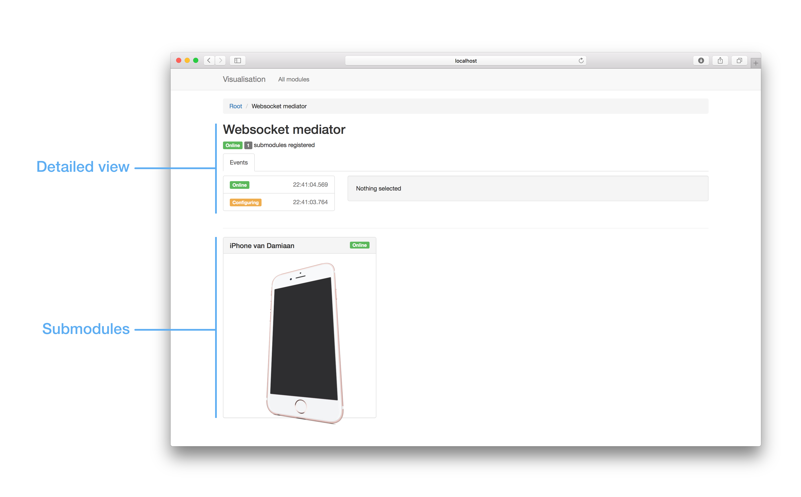

# User manual

When you open the application in your browser you are presented with an overview of all the available modules in the network. When you click on a module's name, a new page opens with the details of that module and its submodules 

## Detail view

The standard detail view indicates the current state of the module and it's submodule count. Apart from this, module developers can add different tabs to the detail view according to their needs. In the above image, you can only see one tab (it's named: Events)

## Submodules

Underneath the detail view, the module's submodules are listed. Just like on the home page, you can click on the name of the submodule to inspect more details of that submodule.

Note: module developers can make as many submodule levels as they want.