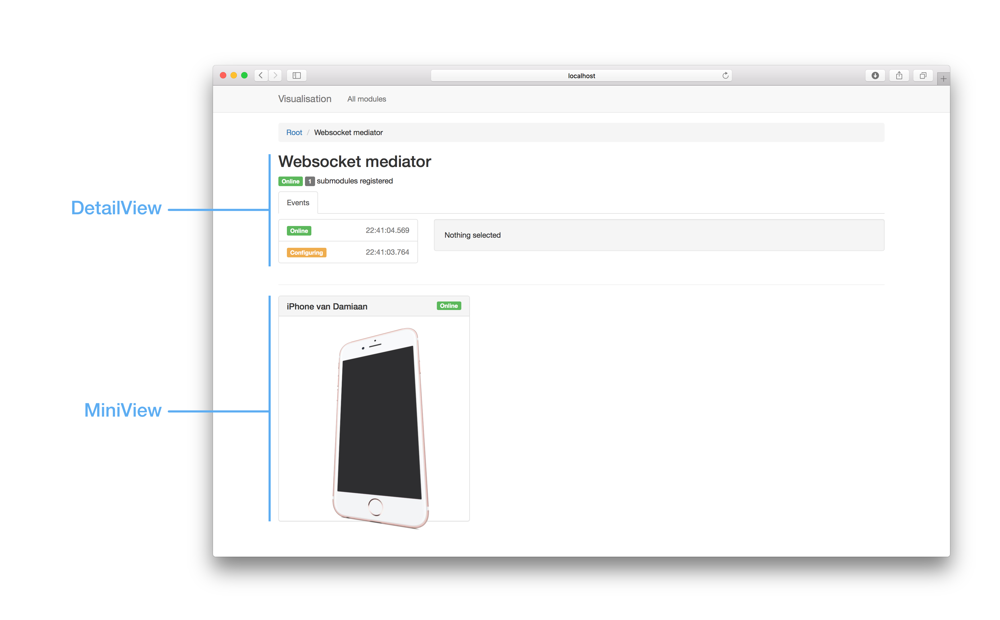
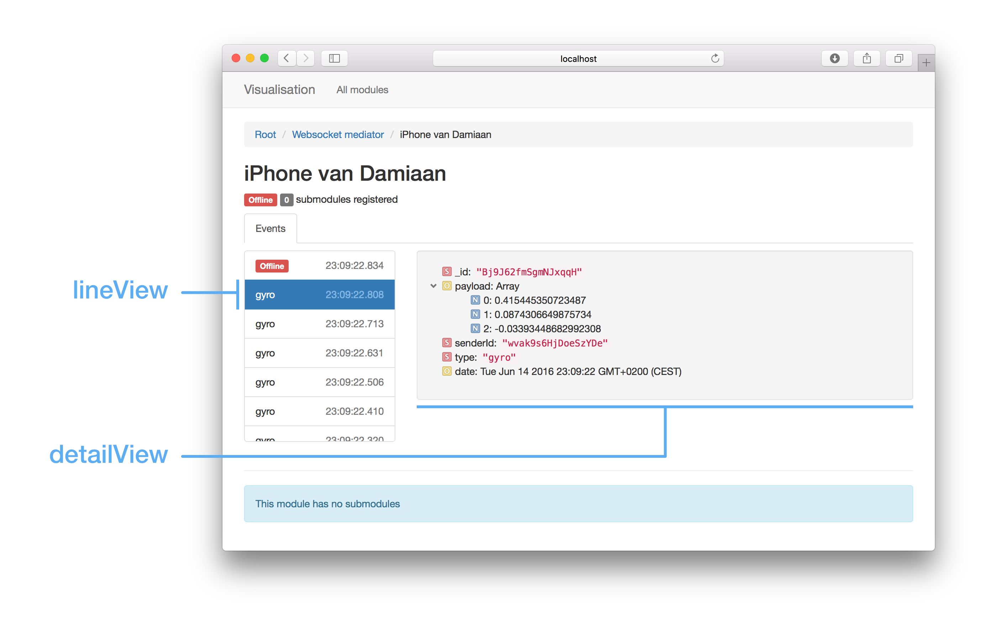

# Extension system

The extesion system allows developers to hook into the visualisation framework and provide custom visualisations for their modules and the events that they sent.

## Architecture

The base architecture of the visualisation system always comes back to two entities **modules** and **events**.

### Modules

Modules can have to different representations: a `miniView` and a `detailView`. In the following image you see the `detailView` of the Websocket mediator. Below the view of this module, you see the `miniView`'s of all its submodules.



#### Detail view pages

Inside the detail view you can see a tab called 'events'. This is what we call a `detailViewPage`.

### Events

The events follow a similar system, but here, the views are called: `lineView` and `detailView`. 

## Creating your own views

To create views you need to make a [Spacebars](http://guide.meteor.com/blaze.html) template. Follow the link to read more about how to do that. For an example you can look at how the generic components are implemented in the `visualisation:generic-components` package.

### Modules

The `detailView` aswell as the `miniView` templates will be included in the application with a data context that looks like

```javascript
{
  module: {
    _id: '8EF9BQT3734920D',
    parentId: null,
    subModuleCount: 2,
    name: 'Your module name',
    type: 'a_module_type',
    state: 2
  }
}
```

### Events

The event views will be included with a data context like

```javascript
{
  event: { /*... your module's event ...*/ }
}
```

## Registering custom views

When you have created your custom templates you still need to couple them to certain modules or events.

First describe your custom module using a `ModuleDescriptor`

```javascript
import {ModuleDescriptor} from 'meteor/visualisation:extension-system'

export const iphoneModuleDescriptor = new ModuleDescriptor({
	miniView: 'TheTemplateNameForYourMiniView',
	detailView: 'TheTemplateNameForYourDetailView',
	detailPageViews: ['ACustomDetailPage', 'AnotherDetailPage']
})
```

Then describe the events for this module using the `EventDescriptor`

```javascript
import {EventDescriptor} from 'meteor/visualisation:extension-system'

const incomingCallDescriptor = new EventDescriptor({
	detailView: 'IncomingCallDetialView',
	lineView: 'IncomingCallLineView'
})
```

When you have described your module and its events, register them in the registry. A module descriptor can be coupled to all modules of a certain `type` by calling `registerModuleDescriptor(moduleType, descriptor)`. Here is an example:

```javascript
import {registerModuleDescriptor} from 'meteor/visualisation:extension-system'

registerModuleDescriptor('iPhone', iphoneModuleDescriptor)
```

The only thing that is left now, is registering the event descriptor for a certain event `type`.

```javascript
iphoneModuleDescriptor.registerEvent('incomingCall', incomingCallDescriptor)
```